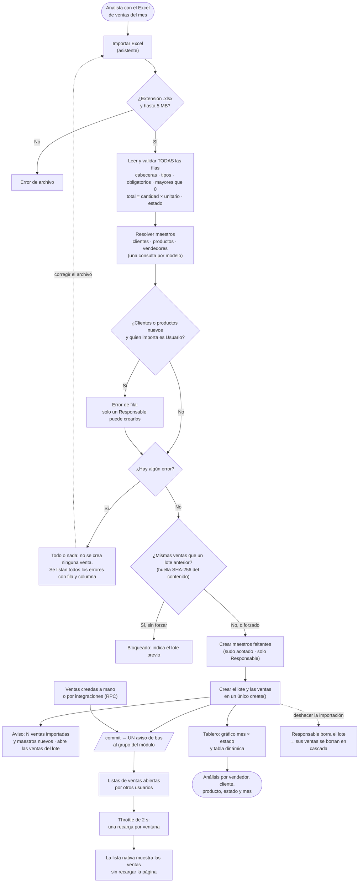

# Prueba técnica Odoo 19: `sales_import_analytics`

Módulo para Odoo 19 Community con estas funciones:

1. **Importar** las ventas del mes desde un Excel mediante un asistente.
2. **Validarlas** por completo: si una fila falla no se importa nada y se muestran todos los errores.
3. **Guardarlas** en un modelo propio.
4. **Analizarlas** en un tablero con gráfico y tabla dinámica.
5. **Mostrar en tiempo real** en la lista de ventas los registros nuevos que crean otros usuarios o procesos, sin recargar la página y sin polling.

| | |
|---|---|
| Módulo | [`sales_import_analytics/`](sales_import_analytics/) (versión `19.0.1.0.7`) |
| Excel de ejemplo | [`samples/ventas_junio_2026.xlsx`](samples/ventas_junio_2026.xlsx) (válido, 24 ventas) · [`samples/ventas_julio_2026.xlsx`](samples/ventas_julio_2026.xlsx) (válido, 18 ventas) · [`samples/ventas_agosto_2026.xlsx`](samples/ventas_agosto_2026.xlsx) (válido, 16 ventas) · [`samples/ventas_con_errores.xlsx`](samples/ventas_con_errores.xlsx) (10 errores) |
| Tests | 57 tests Python + 12 tests JS (hoot, Chrome headless), todos en verde |

---

## 1. Instalación

### Requisitos

- Docker con Docker Compose v2.
- Un clon de Odoo 19 Community: `git clone -b 19.0 --depth 1 https://github.com/odoo/odoo.git`.

### Puesta en marcha

```bash
cp .env.example .env                 # ajustar ODOO_SRC a la ruta del clon de Odoo 19
mkdir -p logs && chmod 777 logs      # el contenedor escribe logs/odoo.log
docker compose build odoo
docker compose up -d                 # el primer arranque crea la BD odoo19_db con `base`
```

Instalar el módulo:

```bash
docker exec odoo_19 python3 /opt/odoo/odoo-bin -d odoo19_db \
  --db_host=db --db_user=odoo --db_password=odoo \
  --addons-path=/opt/odoo/addons,/mnt/extra-addons \
  -i sales_import_analytics --stop-after-init --http-port=8099
docker restart odoo_19
```

Abrir **http://localhost:8070** con el usuario `admin` y la contraseña `admin`. El administrador ya es *Responsable* del módulo.

> **Si en el mismo navegador usas otro Odoo en `localhost`** (por ejemplo, un Odoo Enterprise en el puerto 8069), las cookies se comparten, porque se asignan por host y no por puerto. Esto tiene dos efectos:
> - Iniciar sesión en uno cierra la sesión del otro (`session_id`).
> - Si el otro tiene el modo oscuro activado, la cookie `color_scheme=dark` hace que el gráfico del tablero pinte ejes y leyenda en blanco sobre el fondo claro de Community.
>
> Para evitarlo, abre este Odoo con otro nombre de host, por ejemplo **http://127.0.0.1:8070**, o borra la cookie `color_scheme` de `localhost`.

| Servicio | Contenedor | Host |
|---|---|---|
| Odoo 19 | `odoo_19` | `localhost:8070` |
| PostgreSQL 16 | `odoo19_db` | `localhost:5433` |

**Cómo está montado el entorno.**

- La imagen `odoo:19.0` solo aporta el *runtime*: Python, wkhtmltopdf y las librerías. El código de Odoo es el del clon local, montado en solo lectura en `/opt/odoo`.
- El `Dockerfile` elimina el Odoo que trae la imagen. Si no, sus addons entrarían en el namespace `odoo.addons` por delante de los del clon.
- El `Dockerfile` también instala Chrome y `websocket-client` para los tests JS.
- `docker-compose.override.yml` activa el modo desarrollo (`--dev=reload,xml`).

### Ejecutar los tests

```bash
docker exec odoo_19 python3 /opt/odoo/odoo-bin -d odoo19_db \
  --db_host=db --db_user=odoo --db_password=odoo \
  --addons-path=/opt/odoo/addons,/mnt/extra-addons \
  -u sales_import_analytics --test-enable --test-tags=/sales_import_analytics \
  --stop-after-init --http-port=8099
```

Resultado esperado en el log: `[HOOT] Test suite succeeded` y `0 failed, 0 error(s)`.

---

## 2. Uso

La aplicación **Análisis de Ventas** tiene estos menús:

| Menú | Qué hace |
|---|---|
| **Tablero** | Gráfico de barras por mes con los estados **apilados** (Confirmada, Borrador, Cancelada), tabla dinámica mes × estado y lista. El segmento *Confirmada* es el total vendido; el filtro **Confirmadas** está a un clic. |
| **Ventas** | Lista en tiempo real, formulario, gráfico y tabla dinámica. Búsqueda y agrupación por vendedor, cliente, producto, estado, mes y lote. |
| **Importar Excel** | Asistente de importación. |
| **Configuración → Lotes de importación** | Cada archivo importado: quién lo importó, cuándo, cuántas ventas y cuántos maestros nuevos creó. Borrar un lote deshace esa importación. |
| **Configuración → Vendedores** | Catálogo de vendedores, con enlace opcional a un usuario de Odoo. |

### Formato del Excel

`Fecha | Cliente | Vendedor | Producto | Cantidad | Valor Unitario | Valor Total | Estado`

El importador tolera las variaciones habituales de un archivo hecho a mano:

- **Cabeceras:** en cualquier orden, sin distinguir mayúsculas ni tildes. Las columnas extra se ignoran.
- **Fechas:** celda de fecha, o texto `AAAA-MM-DD` o `DD/MM/AAAA`.
- **Números:** celda numérica, o texto en formato colombiano (`1.234,50`).
- **Estados:** *Borrador*, *Confirmada* o *Cancelada*, y sus variantes (*confirmado*, *Confirmed*, *Anulada*…).
- **Nombres:** "Cliente A", "cliente a " y "CLIENTE A" son el mismo cliente.
- **Filas vacías:** se ignoran.

Límites: 5 MB y 10.000 filas por archivo.

### Prueba rápida con los ejemplos

1. Importa `samples/ventas_con_errores.xlsx`. No se crea ninguna venta y aparecen **10 errores**, cada uno con su fila, columna y motivo:

   ```text
   Fila 3 · Cliente: Campo obligatorio.
   Fila 5 · Valor Total: No coincide con Cantidad × Valor Unitario: se esperaba 9,840,000.00 y se recibió 9,000,000.00.
   Fila 6 · Estado: Estado no reconocido «Pendiente». Valores admitidos: Borrador, Confirmada, Cancelada.
   Fila 7 · Fecha: Fecha no válida «31/02/2026». Use una celda de fecha o el formato AAAA-MM-DD o DD/MM/AAAA.
   …
   ```

2. Importa `samples/ventas_junio_2026.xlsx`. Aparece el aviso *"24 ventas importadas (7 clientes, 6 productos y 4 vendedores nuevos)"* y se abren las ventas del lote.
3. Abre **Tablero**. Junio de 2026 muestra tres segmentos: *Confirmada* **81.128.750** (19 ventas), *Borrador* 36.600.000 y *Cancelada* 6.660.000. Con el filtro *Confirmadas* queda solo el total vendido.
4. Importa `samples/ventas_julio_2026.xlsx`. Reutiliza los clientes, productos y vendedores de junio (aunque estén escritos con otras mayúsculas) y solo crea los nuevos: *"18 ventas importadas (2 clientes, 1 productos y 1 vendedores nuevos)"*. El tablero pasa a mostrar dos meses; julio suma **104.035.000** confirmadas (13 ventas).
5. Vuelve a importar cualquiera de los dos archivos. Se bloquea porque ya se importó, **aunque el archivo se haya vuelto a guardar** (se compara el contenido, no los bytes). Marcando *Importar de todas formas* se importa de nuevo.
6. **Tiempo real:** abre *Ventas* en dos navegadores (o en una ventana privada) e importa `samples/ventas_agosto_2026.xlsx` en uno de ellos. En el otro aparecen las 16 ventas de agosto sin recargar, con una sola recarga de la lista. Para simular un flujo continuo de ventas:

   ```bash
   docker exec -i odoo_19 python3 /opt/odoo/odoo-bin shell -d odoo19_db --db_host=db \
     --db_user=odoo --db_password=odoo --addons-path=/opt/odoo/addons,/mnt/extra-addons \
     --http-port=8098 < scripts/simulate_sales_stream.py
   ```

   Crea una venta cada 300 ms durante 20 s. En la pestaña *Red* de las herramientas de desarrollo se ve una recarga cada 2 s mientras dura el flujo, y ninguna cuando se detiene.

Los Excel se regeneran con `python3 scripts/generate_sample_excels.py`.

---

## 3. Diseño

### Flujo de negocio



Las ventas creadas a mano o por una integración pasan por las mismas validaciones del modelo y generan el mismo aviso en tiempo real, porque ambas cosas viven en `sales.import.record` y no en el asistente.

### Modelos

| Modelo | Propósito |
|---|---|
| `sales.import.record` | La venta. `Many2one` a `res.partner`, `product.product` y al vendedor; importes `Monetary` en la moneda de la compañía; `state` (`draft` / `confirmed` / `cancelled`). Índices en fecha, cliente, vendedor, producto, estado y lote, que son las dimensiones del tablero. |
| `sales.import.batch` | El lote: archivo, huella SHA-256 del contenido, número de ventas y de maestros creados. Las ventas se borran en cascada con él. |
| `sales.import.salesperson` | El vendedor tal como aparece en el Excel, con un `user_id` opcional. |
| `sales.import.wizard` | El asistente (`TransientModel`). |

### Decisiones

| Tema | Decisión | Por qué |
|---|---|---|
| Cliente / Producto | `Many2one` con búsqueda o creación. Productos por referencia interna y luego por nombre. | Con `Char`, "Cliente A" y "cliente a" serían dos clientes en el análisis. |
| Vendedor | Modelo propio, **nunca `res.users`** | Crear usuarios desde un Excel implica accesos y licencias. Además, el vendedor de un archivo externo no tiene por qué ser usuario. |
| Validación | En el **modelo** (`models.Constraint` + `@api.constrains`) y además en el parser | Se cumple por cualquier vía de creación: UI, importación o RPC. El parser, además, reporta los errores por fila. |
| Todo o nada | Se valida todo antes de crear nada | Una importación parcial impide reimportar el archivo corregido sin duplicar. |
| Valor Total | Se guarda el del archivo y se valida contra cantidad × unitario con la tolerancia de redondeo de la moneda | Sin descuentos ni impuestos en el archivo, una diferencia solo puede ser un error de datos. |
| Duplicados | Por archivo, no por fila, con una huella SHA-256 de las **ventas leídas** (nombres normalizados, sin importar el orden) y no de los bytes | Dos filas iguales pueden ser dos ventas reales; el mismo archivo dos veces, no. Excel guarda metadatos como la fecha de guardado, así que un hash de los bytes no detectaría un archivo abierto y vuelto a guardar sin cambios. |
| "Total del mes" | Agrupación por mes de la fecha de venta, con los estados apilados en el gráfico | Un filtro "este mes" dejaría vacío el tablero para datos de junio de 2026. Apilar por estado separa el total vendido (*Confirmada*) sin ocultar borradores ni canceladas; un filtro por defecto las hacía invisibles. |
| Tablero | Vistas nativas graph y pivot | Cubren el enunciado sin reimplementar gráficos. |
| Multicompañía | `company_id` y reglas estándar en ventas y lotes | Patrón idiomático de Odoo y de bajo coste. |

### Seguridad

- Dos grupos bajo un `res.groups.privilege` (Odoo 19):
  - **Usuario:** consulta, importa, crea y edita.
  - **Responsable:** además, borra ventas y lotes.
- Un usuario interno de Odoo 19 **no puede crear** contactos ni productos (hacen falta `base.group_partner_manager` y `product.group_product_manager`). Para no conceder esos grupos, que permiten editar precios, la creación de clientes y productos que faltan usa un **`sudo()` acotado**, documentado como excepción en la constitución del proyecto:
  - solo `create`, nunca `write` ni `unlink`;
  - campos en lista blanca (`name`; `type='consu'`);
  - solo si quien importa es **Responsable**;
  - todo lo creado queda contado en el lote.

  Si quien importa es un *Usuario*, un cliente o producto inexistente es un error de fila.
- Búsquedas con `=ilike` y `escape_psql`. No hay SQL armado a mano ni `eval` de datos del archivo.
- El archivo se valida en formato real, tamaño y número de filas antes de procesarlo.

### Estructura del código

```text
sales_import_analytics/
├── models/            venta, lote y vendedor (invariantes y aviso de bus)
├── tools/             sales_excel_parser.py: lectura y validación pura, sin ORM (bytes → filas + errores)
├── wizard/            orquestación: comprobar duplicado, parsear, resolver referencias y crear
├── security/          privilegio, grupos, reglas multicompañía y ACL
├── views/             lista (js_class), formulario, búsqueda, gráfico, tabla dinámica y menús
├── static/src/        trailing_throttle.js y el controlador de la lista en tiempo real
├── static/tests/      tests hoot (throttle y controlador)
└── tests/             tests Python y el runner de los tests JS
```

El parser no conoce el ORM. Recibe como parámetro unas `AmountRules`: cómo redondear la cantidad y cómo comparar importes con la tolerancia de la moneda. Así valida los valores **tal como los guardará el modelo**, y una fila aceptada no puede fallar después sin número de fila. Sus mensajes se traducen de forma explícita con `ParseError.render(env._)`. El asistente solo orquesta. Para resolver las referencias hace **una consulta por modelo**, no una por fila, y crea todas las ventas en **un único `create`**. Un archivo de 10.000 filas se importa en unos 2 s.

---

## 4. Notificaciones en tiempo real

### 4.1 Mecanismo de notificación

**Qué se usa: el bus de Odoo sobre websocket.** No hay polling.

**Qué dispara el aviso** ([`models/sales_import_record.py`](sales_import_analytics/models/sales_import_record.py)). El `create` del modelo envía **un aviso por lote**, sea cual sea el número de registros:

```python
@api.model_create_multi
def create(self, vals_list):
    records = super().create(vals_list)
    if records:
        records._notify_new_records()
    return records

def _notify_new_records(self):
    self.env.ref(NOTIFIED_GROUP)._bus_send(NEW_RECORDS_NOTIFICATION, {})
```

- **Por qué en `create` y no en el asistente.** Así avisa cualquier vía de creación: una importación, un usuario desde el formulario o una integración por RPC.
- **A quién se envía.** El canal es el **grupo del módulo**. En Odoo 19, `res.groups` hereda `bus.listener.mixin`, y `ir.websocket._build_bus_channel_list` suscribe cada sesión a los canales de **todos los grupos de su usuario** (`channels.extend(self.env.user.all_group_ids)`). Resultado: solo reciben el aviso quienes tienen acceso al módulo, sin un canal de texto adivinable, sin override y sin `addChannel` en el cliente.
- **Qué lleva el aviso.** El payload va **vacío**: el aviso solo dice "hay novedades". Cada navegador recarga con sus propios permisos, así que el bus nunca transporta datos que el receptor quizá no pueda ver.
- **Cuándo sale.** El bus encola el mensaje en `cr.precommit`, de modo que **solo se envía si la transacción hace commit**. Una importación que falla y hace rollback no avisa de nada.

**Qué lo recibe.** El servicio `bus_service` del navegador. El controlador de la lista se suscribe al tipo `sales_import_analytics/new_records`.

**Reconexión.** No hace falta código propio. Al reconectarse, el worker del websocket envía el id del último aviso recibido (`last`) y el servidor reenvía los que se perdieron.

**Evidencia contra el servidor real.** Importar 25 ventas generó **1** aviso por websocket, con una latencia de 0,52 s incluida la importación.

### 4.2 Control de ráfagas

**Qué se usa: un throttle que ejecuta al inicio y al final de cada ventana** (leading + trailing), con ventanas de 2 s ([`static/src/utils/trailing_throttle.js`](sales_import_analytics/static/src/utils/trailing_throttle.js)).

```js
export function createTrailingThrottle(callback, interval) {
    let timeoutId = null;
    let pending = false;
    function openWindow() { timeoutId = setTimeout(closeWindow, interval); }
    function closeWindow() {
        timeoutId = null;
        if (pending) { pending = false; run(); }
    }
    function run() { openWindow(); callback(); }   // la ventana se abre antes de ejecutar
    return {
        call() { if (timeoutId !== null) { pending = true; return; } run(); },
        cancel() { clearTimeout(timeoutId); timeoutId = null; pending = false; },
    };
}
```

Cómo se comporta:

- **Primer aviso:** con el throttle en reposo, recarga **al instante**. La latencia es mínima.
- **Avisos dentro de la ventana:** solo la marcan como pendiente.
- **Cierre de la ventana:** si hubo avisos, **una** recarga y se abre otra ventana.

| Escenario | Resultado |
|---|---|
| Ráfaga (200 avisos a la vez) | **2 recargas**: la primera y la del final |
| Flujo sostenido (un aviso cada 300 ms) | **Una recarga cada 2 s** mientras dure |
| Último aviso de una secuencia | Siempre termina en una recarga, sin perder ventas |
| Sin avisos | Ninguna petición |

**Por qué no un debounce simple.** Un debounce ("recargar N ms después del *último* aviso") resuelve la ráfaga corta, pero **falla con un flujo sostenido**. Si los avisos llegan cada 300 ms y el debounce espera 1 s, el temporizador se reinicia en cada aviso y **nunca recarga mientras dure el flujo**. Es un caso de inanición: el usuario vería la lista congelada justo cuando más ventas entran. Ocurre por ejemplo con una integración que carga ventas de forma continua o con varios vendedores importando a la vez.

Odoo 19 usa precisamente ese debounce para un caso parecido (`im_livechat/static/src/views/livechat_looking_for_help_controller_mixin.js`, `useDebounced` de 300 ms). Además, el `debounce` de `@web/core/utils/timing` no tiene `maxWait`, así que no puede resolverlo.

El test [`trailing_throttle.test.js`](sales_import_analytics/static/tests/trailing_throttle.test.js) lo demuestra con el propio `debounce` de Odoo: 0 ejecuciones durante un flujo de 10 s.

**Evidencia en Chrome real.** Con la lista abierta y 62 ventas creadas en 20 s (una cada 300 ms, cada una con su commit y su aviso), la lista recargó a los 13.1, 15.1, 17.1… 33.1 s: **una vez cada 2,0 s** durante todo el flujo. Luego no hubo ninguna recarga en reposo ni errores en la consola.

### 4.3 Integración sin duplicar la UI

Se extiende **solo el controlador** de la lista nativa y se registra como una variante de vista con `js_class` ([`sales_realtime_list_view.js`](sales_import_analytics/static/src/views/sales_realtime_list/sales_realtime_list_view.js)):

```js
export class SalesRealtimeListController extends ListController {
    setup() {
        super.setup();
        this.busService = useService("bus_service");
        this.reloadThrottle = createTrailingThrottle(() => this.reloadList(), RELOAD_INTERVAL_MS);
        this.onNewRecords = () => this.reloadThrottle.call();
        this.busService.subscribe(NEW_RECORDS_NOTIFICATION, this.onNewRecords);
        onWillDestroy(() => {
            this.busService.unsubscribe(NEW_RECORDS_NOTIFICATION, this.onNewRecords);
            this.reloadThrottle.cancel();
        });
    }

    async reloadList() {
        if (status(this) === "destroyed") return;
        if (this.isUserBusy()) {   // edición en línea o filas seleccionadas: reintentar luego
            this.reloadThrottle.call();
            return;
        }
        await this.model.load();
    }

    isUserBusy() {
        const { root } = this.model;
        return Boolean(root.editedRecord || root.selection.length);
    }
}

registry.category("views").add("sales_import_realtime_list", {
    ...listView,
    Controller: SalesRealtimeListController,
});
```

```xml
<list string="Ventas" js_class="sales_import_realtime_list"> … </list>
```

- **Qué se reutiliza.** El renderer, el modelo relacional, el template, la paginación, la selección y la edición son los de la lista estándar.
- **Cómo se recarga.** `model.load()` sin parámetros reutiliza la configuración vigente, así que se conservan filtros, agrupaciones, orden y página. Es la misma recarga que haría el propio Odoo.
- **Qué pasa si el usuario está trabajando.** Si hay una fila en edición en línea o filas seleccionadas para una acción, la recarga se aplaza a la siguiente ventana, en lugar de descartar lo que escribe o perder la selección.

**Cuándo sí haría falta un componente nuevo.** Cuando la interfaz tenga que mostrar algo que la lista no sabe pintar. Por ejemplo:

- un aviso de "12 ventas nuevas, pulsa para verlas", para no mover la lista mientras el usuario lee;
- resaltar las filas recién llegadas;
- combinar tarjetas de indicadores con la lista.

Aun así, lo correcto sería un componente que **envuelva** la vista nativa (con `View` de `@web/views/view`) o un `patch` del renderer, nunca una lista reescrita.

### 4.4 Limpieza de recursos y condición de carrera

**Cómo se deja de escuchar al salir.**

- La suscripción se hace en `setup()` y se deshace en **`onWillDestroy`**: `unsubscribe` más `cancel()` del throttle.
- **Por qué `onWillDestroy` y no `onWillUnmount`.** Un componente puede destruirse **sin haber llegado a montarse**, por ejemplo si el usuario cambia de menú mientras carga la lista. En ese caso `onWillUnmount` no se ejecuta, y la suscripción hecha en `setup()` quedaría huérfana.
- **Una función por instancia.** El callback es propio de cada controlador (`this.onNewRecords`). `bus_service` guarda un mapa de callback a wrapper, así que dos listas abiertas no pueden compartir la misma función sin pisarse al darse de baja.

**Qué pasa si llega un aviso justo al salir.** JavaScript es monohilo, así que el aviso se procesa *antes* o *después* del `unsubscribe`, nunca a la vez:

- **Si llega antes:** a lo sumo deja una recarga programada en el throttle, y `cancel()` la elimina.
- **Si llega después:** ya no hay nadie escuchando.
- **Si había una recarga en curso** (`model.load()` esperando la respuesta del servidor cuando el usuario sale): la guarda `status(this) === "destroyed"` impide lanzar recargas nuevas, y OWL ignora el renderizado de un componente destruido. No hay errores ni peticiones fantasma.

El test *"after destroying the view nothing listens nor reloads"* ([`sales_realtime_list.test.js`](sales_import_analytics/static/tests/sales_realtime_list.test.js)) lo comprueba así: deja una recarga pendiente, destruye la vista, avanza el tiempo, envía otro aviso y verifica que no hay ninguna petición.

---

## 5. Tests

| Archivo | Qué cubre |
|---|---|
| `test_sales_excel_parser.py` | Cabeceras tolerantes, formatos de fecha y número, variantes de estado, filas vacías; cada error de fila y de archivo (no Excel, vacío, sin cabeceras, sin filas, límite de filas); reporte completo con número de fila. |
| `test_sales_import_record.py` | Restricciones SQL y de coherencia (también al editar), tolerancia de redondeo, vendedor único sin distinguir mayúsculas, aislamiento multicompañía, agregación del tablero por mes. |
| `test_sales_import_wizard.py` | Importación completa, unificación de variantes, reutilización de maestros, que nunca se crea `res.users`, todo o nada, archivo inválido y límite de tamaño, duplicado y forzado, Usuario frente a Responsable, borrado en cascada y permisos, **10.000 filas en menos de 30 s**. |
| `test_realtime_notification.py` | Un aviso por lote, ninguno sin registros, canal, tipo y payload vacío; una importación genera un solo aviso. |
| `static/tests/trailing_throttle.test.js` | Ráfaga, flujo sostenido, disparo final garantizado, cancelación, llamada reentrante y contraste con el debounce. |
| `static/tests/sales_realtime_list.test.js` | La lista nativa recarga ante un aviso; una ráfaga produce 2 recargas; tras destruir la vista no hay oyentes ni recargas; ni una edición en línea ni una selección de filas se pierden. |

---

## 6. Limitaciones conocidas

- Solo `.xlsx` y solo la primera hoja del libro.
- La comparación de nombres no distinguye mayúsculas pero **sí tildes** ("Pérez" ≠ "Perez"). Es coherente con `=ilike` en PostgreSQL y evita crear duplicados frente a la base de datos.
- En multicompañía, un usuario del grupo en otra compañía también recibe el aviso y recarga su lista sin ver cambios. El coste es bajo y el payload vacío no filtra datos.
- Los colores del gráfico los asigna Odoo por orden de serie, no por estado (por ejemplo, *Confirmada* puede salir en rojo). Fijarlos exigiría parchear el renderer del gráfico.
- Los importes de los mensajes de error se formatean con separadores fijos (`9,840,000.00`), no con los del idioma del usuario.
- **Escala de la resolución de referencias.** Se hace una consulta por modelo, pero cada consulta es un `OR` de condiciones `=ilike`, una por nombre distinto. Con cientos de nombres por archivo (el caso de un mes de ventas) es inmediato. Con miles de nombres distintos contra cientos de miles de contactos convendría una sola comparación `lower(name) IN (...)` con la clase `SQL`.
- Si se borra un lote o una venta, las listas abiertas no se recargan: el aviso en tiempo real cubre las creaciones, que es lo que pide el enunciado. Las ventas borradas desaparecen en la siguiente recarga.

---

## 7. Uso de herramientas agénticas (Claude Code)

El desarrollo se hizo con **Claude Code**. El agente trabajó siempre bajo supervisión: las decisiones de negocio y de seguridad las tomó el desarrollador.

### Configuración

| Archivo | Propósito |
|---|---|
| [`CLAUDE.md`](CLAUDE.md) | Prompt base del proyecto: enunciado resumido, decisiones de diseño aprobadas, estándares de Odoo 19, Clean Code, SOLID aplicado a Odoo, rendimiento, seguridad (incluida la excepción de `sudo()`), flujo de trabajo, ramas y bump de versión. |
| [`.claude/skills/odoo-19`](.claude/skills/odoo-19) | Base de conocimiento de la API de Odoo 19 (18 guías; `unclecatvn/agent-skills`). |
| [`.claude/skills/ponytail`](.claude/skills/ponytail) | Fuerza la solución más simple que funciona (YAGNI) y contrarresta el sobre-diseño. |
| [`.claude/skills/caveman`](.claude/skills/caveman) | Respuestas concisas en el chat, para ahorrar tokens. No aplica a los entregables. |
| [`.claude/skills/speckit-*`](.claude/skills) | [GitHub Spec Kit](https://github.com/github/spec-kit): desarrollo guiado por especificación. |
| [`skills-lock.json`](skills-lock.json) | Origen y hash de las skills instaladas con `npx skills`. |

Una regla de `CLAUDE.md` fija el código fuente de Odoo 19 del clon local como **fuente de verdad**. Cada API se verificó ahí con búsquedas dirigidas, y no se dio por buena la memoria del modelo ni lo que dijera la skill.

### Flujo de trabajo

1. **Spec Kit.** Pasos: `constitution` (principios, versión 1.1.0) → `specify` (4 historias, 29 requisitos, 10 criterios medibles) → `clarify` (4 preguntas, más 1 decisión de seguridad durante el plan) → `plan` (investigación contra el código de Odoo, modelo de datos, contratos) → `tasks` (44 tareas) → `analyze` (coherencia entre artefactos) → `implement`. Por decisión del desarrollador, los artefactos (`specs/`, `.specify/`) se quedan en local y no se versionan.
2. **Incrementos.** Cada fase cierra con el módulo actualizado en Docker, los tests en verde, el bump de versión y un commit (ver `git log`).
3. **Registro.** En un archivo de contexto no versionado se anotaron las decisiones y correcciones; de ahí sale esta sección.

### Decisiones y cómo se supervisó al agente

**El desarrollador corrigió al agente**:

| Tema | Propuesta del agente | Decisión del desarrollador | Motivo |
|---|---|---|---|
| Vendedor | `res.users` | Modelo propio | Evitar crear usuarios y que el Excel de ejemplo falle en otra base de datos |
| Total del mes | Filtro "este mes" | Agrupar por mes | El tablero quedaría vacío para el evaluador |
| Duplicados | No detectarlos | Detección por huella del contenido | Poder reimportar con seguridad y deshacer un lote |

**Conflicto de seguridad detectado por el agente, resuelto por el desarrollador.** Durante el plan, el agente verificó que un usuario interno de Odoo 19 no puede crear contactos ni productos. Eso chocaba con "buscar o crear" y con la regla de la constitución que prohíbe `sudo()`. En lugar de romper la regla en silencio, lo planteó como decisión. El desarrollador eligió un `sudo()` acotado solo para Responsables y pidió **enmendar la constitución** con una excepción documentada de cuatro condiciones.

**Pedido explícito del desarrollador.** Añadir Clean Code, SOLID y seguridad como reglas. El agente las acotó con la regla *"si un principio empuja a una abstracción sin segundo uso, gana `ponytail`"*, para no sobre-diseñar.

**Errores que encontraron los tests y la verificación, no la revisión a ojo:**

- **Traducción.** La traducción diferida (`_lt`) resuelta en `__str__` fallaba fuera de un contexto con `env`. Se rediseñó a una traducción explícita, `ParseError.render(env._)`.
- **Throttle.** Tenía un bug de reentrada: una llamada desde el propio callback producía recursión infinita. Se detectó al diseñar el test de edición en línea y se corrigió con un test de regresión.
- **Tests JS saltados.** Se saltaban en silencio por falta de `websocket-client`. Se detectó porque en el log no había ninguna línea `[HOOT]`. Lección: comprobar que un test *se ejecuta*, no solo que *no falla*.
- **Tabla dinámica.** `__count` no es válido en el arch de un pivot. Se sustituyó por `pivot_measures` en el contexto, el patrón que usa el propio Odoo.
- **Datos de prueba.** Los tests dependían de datos que ya había en la base de desarrollo. Se aislaron con nombres propios.
- **Versión.** El agente olvidó un bump de versión exigido por `CLAUDE.md` y lo corrigió antes de continuar.

**Revisión de código final (`/code-review`).** Se revisó la rama completa y aparecieron 10 hallazgos. El agente evaluó cada uno antes de actuar y reprodujo el más grave contra el servidor. 9 se corrigieron con un test de regresión cada uno; el décimo (escala de la resolución de referencias) quedó documentado en §6. Los más relevantes:

- **Redondeo.** El parser validaba con los valores crudos, pero el modelo redondea la cantidad a 2 decimales al guardar. Una fila válida para el parser podía fallar en el modelo con un error sin número de fila. Ahora ambos validan los mismos valores.
- **Vendedor archivado.** Un vendedor archivado no se encontraba y se intentaba crear de nuevo, lo que violaba el índice único.
- **Hoja corrupta.** Una hoja con el XML dañado reventaba durante la lectura perezosa en lugar de reportarse como archivo inválido.
- **Selección de filas.** La recarga en tiempo real borraba la selección de filas del usuario.
- **Otros:** `price_unit` se sumaba en la tabla dinámica, no se validaba la extensión del archivo y había etiquetas y límites repetidos.

**Validación con un segundo mes.** Al generar el Excel de julio y regenerar el de junio, junio se importó dos veces. La huella se calculaba sobre los bytes del archivo, y openpyxl (igual que Excel) cambia los bytes en cada guardado. Se corrigió para calcularla sobre las ventas leídas, con tests de regresión. Ahora un archivo reguardado se detecta como duplicado.

**Verificación final, más allá de los tests unitarios.** Importación real por RPC, cliente websocket autenticado contando avisos y Chrome headless (protocolo DevTools) con la lista abierta contando recargas durante un flujo sostenido. Las cifras están en §4.1 y §4.2.
